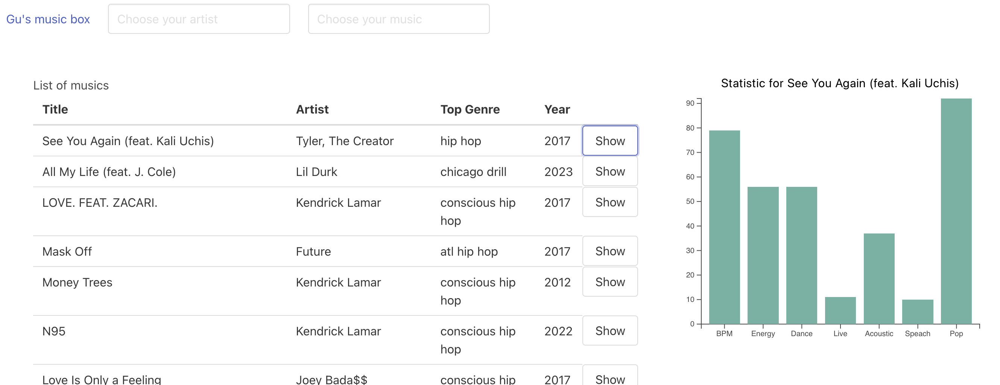

# Gu's music box

1. Le README de votre Github doit documenter le contexte de votre développement en mentionnant, dans l’ordre suivant
	- I. une brève description (en français ou en anglais) de votre rendu et de ses fonctionnalités
	- II. au moins une capture illustrant votre travail ; attention, pour la VR, un GIF est requis
	- III. la procédure d’installation / de lancement
	- IV. les éventuels modules, librairies ou scripts intégrés ou nécessaires au bon fonctionnement de votre rendu
	- V. les éventuels copyrights, informations de licence, et autres références de vos sources et ressources y compris en matière de code récupéré
	- VI. le contexte de développement (exemple : Ce projet a été développé dans le cadre du cours <nom de l’enseignement> dispensé par Isaac Pante (SLI, Lettres, UNIL)).

3. Les limites de votre travail ainsi que les possibilités d’amélioration doivent apparaître comme « issues », assorties des étiquettes adéquates (bug, enhancement, etc.) et non dans le Readme. Gardez à l’esprit que cette description est destinée à d’autres personnes intéressées par votre code, non à l'enseignant.

4. Votre répertoire Github doit porter un nom qui facilite l'identification unique de votre travail ; ce nom peut être pensé comme une "marque" (par exemple : pas de "projet-visualisation" mais plutôt "statistique-vente-armes" ou "weaponview")

5. Attention : aucun matériel soumis à droit d’auteur (images, sons, etc.) ne doit être déposé sur une archive publique. Si du matériel soumis à droit d’auteur est au coeur de votre travail, merci de créer un Github privé (choix "private" au moment de la création).

6. Attention : la récupération partielle de code est autorisée pour peu que la source soit mentionnée à même le code, au travers de commentaires inline ; dans le cas contraire, vous vous exposez à une dénonciation pour plagiat ou fraude.

https://github.com/MShabi/Weapon-id-database-visualized

## Description

Ce projet a pour objectif de présenter les statistiques, sous forme graphique, de chacune des musiques que Guillaume écoute sur Spotify. Vous pouvez sur ce site rechercher les musiques par artistes ou rechercher une musique directement. Un tableau affiche l'ensemble des musiques et un bouton permet de visualiser les statistiques d'une chanson.
Le résultat de se travail est accessible publiquement à l'adresse suivante : https://guipaschoud.github.io/

Ce projet à été développé dans le cadre du cours de visualisation de donnée donné à l'UNIL.

## Le dataset

Pour construire ce site, un dataset doit être construit en se basant sur ce qui est écouté sur Spotify. Pour ce faire, le site 
[organizeyourmusic.playlistmachinery.com](http://organizeyourmusic.playlistmachinery.com/index.html), permet de générer un fichier Excel contenant la liste compléte des musiques avec les statistiques suivantes :

- Genre - le genre du morceau.
- Year - l'année de sortie de l'enregistrement.
- Added - la date la plus ancienne à laquelle vous avez ajouté le morceau à votre collection.
- Beats Per Minute (BPM) - Le tempo de la chanson.
- Energy - L'énergie d'une chanson - plus la valeur est élevée, plus elle est énergique.
- Danceability - Plus la valeur est élevée, plus il est facile de danser sur cette chanson.
- Loudness (dB) - Plus la valeur est élevée, plus la chanson est forte.
- Liveness - Plus la valeur est élevée, plus il est probable que la chanson soit un enregistrement live.
- Valence - Plus la valeur est élevée, plus l'ambiance de la chanson est positive.
- Length - La durée de la chanson.
- Acousticness - Plus la valeur est élevée, plus la chanson est acoustique.
- Speechiness - Plus la valeur est élevée, plus la chanson contient de mots prononcés.
- Popularity - Plus la valeur est élevée, plus la chanson est populaire.
- Duration - La durée de la chanson.

Le fichier généré par le site contenait environ 1500 musiques. Parmi ces 1500 musiques, beaucoup étaient à double, à triple, voire plus. Les duplicats ont été enlevés, car il n'est pas nécessaire de lister plusieurs fois la même information. Une fois nettoyé, le dataset contient désormais 744 entrées qui sont affichées sur le site.

Les données ont été converties au format CSV, plus précisément DSV, pour être lues par D3. Séparer les valeurs par des virgules posait des soucis à la lecture, car certaines chansons et noms d'auteur contenaient aussi des virgules.
Les données sont donc séparées par le caractère `|` qui est bien moins utilisé et permet la lecture et la visualisation de ce dataset.

## Installation et structure du projet.

Ce projet ne requiert aucune installation

- `lib` : Contient des libraires dont D3, permettant d'afficher des graphiques.
- `css` : Contient le style et en particulier le framework bulma pour afficher et aligner les éléments joliment.
- `data`: Contient les dataset pour D3. Il n'y en a qu'un seul actuellement : `spotify.csv`
- `scripts` : Contient le javascript permettant d'afficher les éléments
	- `stats.js` : Fichier contenant des fonctions appelant D3 pour afficher le graphique.
	- `ui.js` : Fichier contenant des fonctions utile à la création d'éléments visuels sur la page.
	- `main.js` : Le fichier principal appelant des fonctions des deux autres scripts. Celui-ci permet de préparer la page.
- `index.html` : Page pincipal affichant tous les éléments permettant la visualisation des données.

## Limites et améliorations :

- Au lieu d'afficher toutes les musiques, en afficher un nombre réduit et rajouter une pagination pour une meilleure expérience.
- Le projet se limite à afficher une musique à la fois. Il pourrait être intéressant d'en comparer plusieurs à la fois sur un même ou différent graphique.
- Le dataset contient originallement les musiques par playlist créer par Guillaume. Une amélioration pourrait permettre de comparer les playlists entre elles ainsi que de rechercher par playlist.

## Sources :

- Framework CSS Bulma : https://bulma.io/

